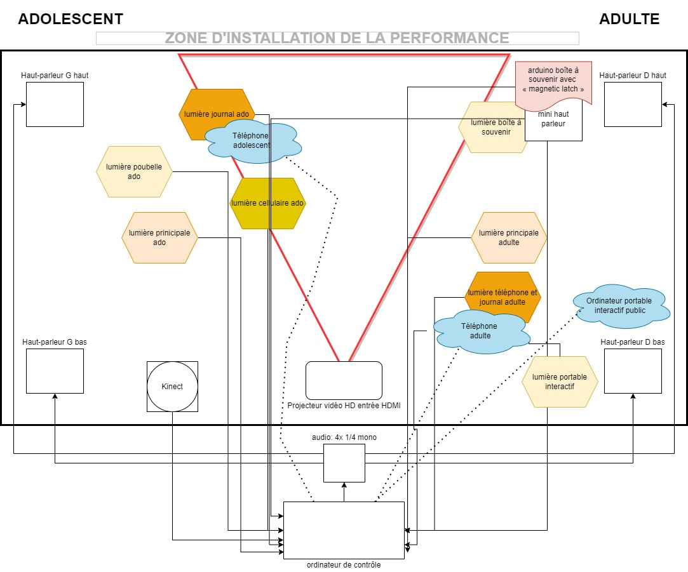

# Chère Sasha (2021-2022)

Chère Sasha est une installations créer et réaliser par les finissant de Troisième année du programme TIM (Techniques d'intégrations multimédias) Les étudiantes/étudiants presenteront leurs installations le lundi 28 mars dans le grand Studio, dans le cégep Montmorency (Laval).

Nous avons eu la chance de visiter les coulisses des installations le 23 février 2022.

L'oeuvre est décrite comme :

Sasha adolescente et Sasha adulte vivent leur vie. 

Durant son adolescence, Sasha se fait négliger par ses parents et cela affecte sa santé mentale. 

Pendant sa vie d'adulte, Sasha habite maintenant seule, Sasha s'accepte, mais ses parents sont toujours contre elle. Cependant, Sasha se porte mieux mentalement qu'avant. 

Le public est appelé à découvrir que les deux vies projetées devant eux sont différents passages de la vie d'une seule et même personne.

 [Le site du projet](https://tim-montmorency.com/2022/projets/Chere-Sasha/docs/web/index.html)

# Membres de l'équipe : 

* Trish Nguyen 

* Angelina Da Silva Jeca 

* Karine Cormier 

* Sabrina Kayani 

# Le thème du temps
  Dans ce projet le thème du temps est exploité de façons à mettre en parralèlle deux passages de la vie de sasha en présentent sont environement et son étas d'esprit en quelques sortes. 

# l'ambiance
  il y aura deux type d'ambience pour illustrer les deux moment de sa vie. En premier, quand elle est adolescente il y aura une ambiance de chambre en desorde, goutte de pluie dans les fenêtres et un ambiance plutot lourde et déprimé. Ensuite, quand elle sera adulte tout semblera plus leger avec des couleur tels que le blanc et un style plus épurer et minimaliste.

# l'installation en cours dans les studios (photos à l'appui)

# le schéma de l'installation prévue (insérer le schéma de plantation, avec la source)

# ce qui sera attendu de vous, en tant qu'interacteur.trice, lorsque vous ferez l'expérience de l'installation

# 3 cours du programme qui vous semblent incontournables pour avoir les compétences pour créer ce projet (voir la grille de cours du programme

une technique* qui sera utilisée dans l'une des oeuvres et que vous ne connaissiez pas
une composante technologique* qui sera utilisée dans l'une des oeuvres et que vous ne connaissiez pas pour cette partie, vous devrez faire des recherches pour mieux connaitre la technique et la composante technologique retenues

