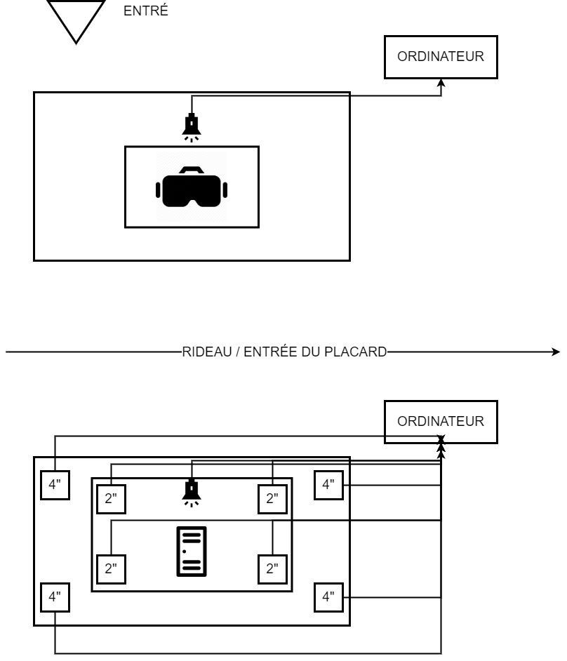

# 3 Minutes (2021-2022) 

3 Minutes est une installations créer et réaliser par les finissant de Troisième année du programme TIM (Techniques d'intégrations multimédias)
Les étudiantes/étudiants presenteront leurs installations le lundi 28 mars dans le grand Studio, dans le cégep Montmorency (Laval).

Nous avons eu la chance de visiter les coulisses des installations le 23 février 2022.

L'oeuvre est décrite comme :

[le site du projet](https://github.com/noo-name/3-minutes/tree/9762b4647b8e10ac247ab1edb8e9492ccfd990ec)

# Membres de l'équipe : 

* Naoufal Bensaiad

* Jérémie Lévesque 

* Samuel Poulin 

# Le thème du temps
Dans ce projet le temps sera exploité au sense propres, il sera aussi utiliser pour dénoncer un message. Le massage que dans la peau d'un jeune qui se fait intimidé 3 minutes ces interminable.

# l'ambiance
 
Premièrement, 3 minutes est un un jeu en réalité virtuelle l'utilisateur va se sentir comme dans la peau d'un étudiant à l'ecole, donc un ambience enfentin, mais pas trop. L'équipe a beaucoup parlé du concept d'un casier. donc il devrait avoir à un certain point des corridor d'ecole et des son de calquement de casier en métal. Il y aura aussi une ambience de solitude de dessin au crayon à la mine foncer. De plus, c'est le seul projet quiimpliquera un système de son avec huit hauts-parleur.

# l'installation en cours dans les studios

> Voici à quoi l'instalation ressemblera

> Voici l'ordinateur qui contrôlera l'expérience

# le schéma de l'installation prévue 

[source plantationo](https://github.com/noo-name/3-minutes/tree/9762b4647b8e10ac247ab1edb8e9492ccfd990ec/docs/preproduction)

# ce qui sera attendu de vous, en tant qu'utilisateur

Premièrement, 3 minutes est un jeu de réalité virtuelle qui va vous immerserer dans la vie d'un jeune qui se fait intimider. l'utilisateur sera appellé a interagir avec plusieur objects en réalité virtuelle et sera immersé dans un monde virtuelle. 

# 3 cours du programme qui vous semblent incontournables pour avoir les compétences pour créer ce projet (voir la grille de cours du programme)
1) Réalité virtuelle session 5 (pour créer des expériences immersives et jeux en réalité virtuelle)

2) Conception sonore interactive sessions 4 (pour créer des univers sonores qui seront interactives)

3) Animation 3D session 4(Pour créer les modèls 3D et environnements 3D avant d'être importé dans les logiciels d'intégrations pour la réalité virtuelle)

