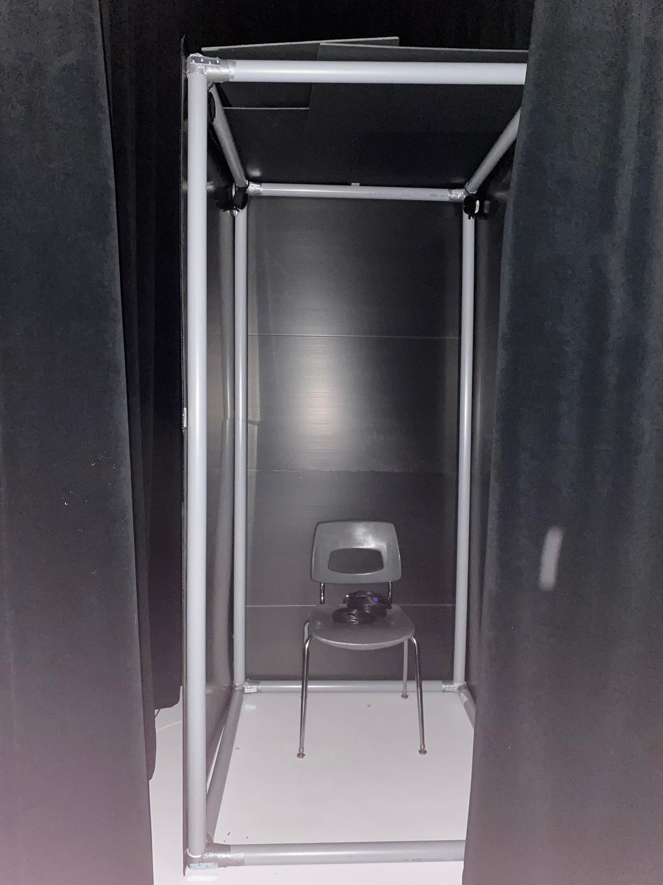
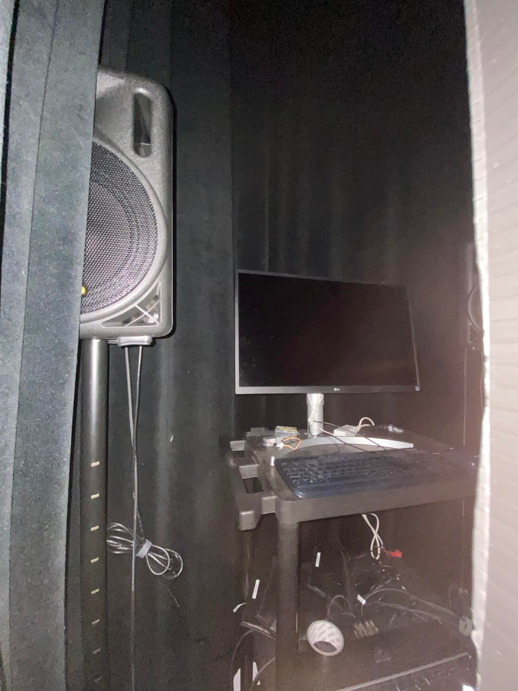

# 3 Minutes (2021-2022) 

3 Minutes est une installations créer et réaliser par les finissant de Troisième année du programme TIM (Techniques d'intégrations multimédias)
Les étudiantes/étudiants presenteront leurs installations le lundi 28 mars dans le grand Studio, dans le cégep Montmorency (Laval).

Nous avons eu la chance de visiter les coulisses des installations le 23 février 2022.

L'oeuvre est décrite comme :

[le site du projet](https://github.com/noo-name/3-minutes/tree/9762b4647b8e10ac247ab1edb8e9492ccfd990ec)

# Membres de l'équipe : 

* Naoufal Bensaiad

* Jérémie Lévesque 

* Samuel Poulin 

# Le thème du temps
Dans ce projet le temps sera exploité au sense propres, il sera aussi utiliser pour dénoncer un message. Le massage que dans la peau d'un jeune qui se fait intimidé 3 minutes ces interminable.

# l'ambiance
 
Premièrement, 3 minutes est un un jeu en réalité virtuel. l'utilisateur va se sentir comme dans la peau d'un étudiant à l'ecole, donc un ambience enfentin, mais pas trop. L'équipe a beaucoup parlé du concept d'un casier. donc il devrait avoir à un certain point des corridor d'ecole et des son de calquement de casier en métal. Il y aura aussi une ambience de solitude de dessin au crayon à la mine fonc
# l'installation en cours dans les studios (photos à l'appui)

> Voici à quoi l'instalation ressemblera

> Voici l'ordinateur qui contrôlera l'expérience

# le schéma de l'installation prévue (insérer le schéma de plantation, avec la source)

# ce qui sera attendu de vous, en tant qu'utilisateur

Cet oeuvre est une instalation interactive qui va insité l'utilisateur à se déplacer dans la chambre de Sasha qui sera divisé en deux. Elle sera divisé en deux pour représenter deux passages dans sa vie. Dans l'instalation il y aura plusieurs pièces de mobillier et object qui seront disposé a plusieur endroit. par example, un telephone cellulaire qui va jouer un vidéo quand l'utilisateur interagie avec celui-ci. Ensuite, à la fin de l'expérience l'utilisateur sera invité à laisser un mot à Sasha qui sera ensuite projeter sur le mur de sa chambre. 

# 3 cours du programme qui vous semblent incontournables pour avoir les compétences pour créer ce projet (voir la grille de cours du programme)
1) Programmation interactive et base de données session 3 / proggramation serveur web session 4 (pour programmer le site web qui recevra les messages, les stocker pour ensuite les projeter.

2) Conception sonore sessions3 (pour crée la bande son qui sera ensuite joué lors de la mise en oeuvre)

3) espace interactif session 5 ( pour contrôler tout les dispositifs qui seront utilisé pour permetre a l'oeuvre de fonctionner, tels que le son, les lumières et la bande vidéo)

une technique* qui sera utilisée dans l'une des oeuvres et que vous ne connaissiez pas
une composante technologique* qui sera utilisée dans l'une des oeuvres et que vous ne connaissiez pas pour cette partie, vous devrez faire des recherches pour mieux connaitre la technique et la composante technologique retenues

