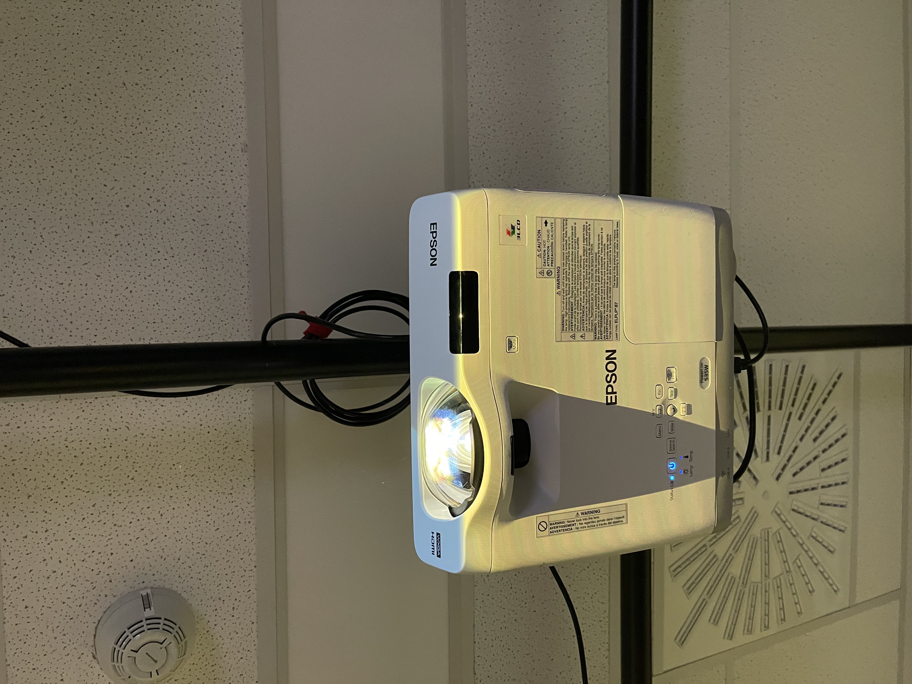
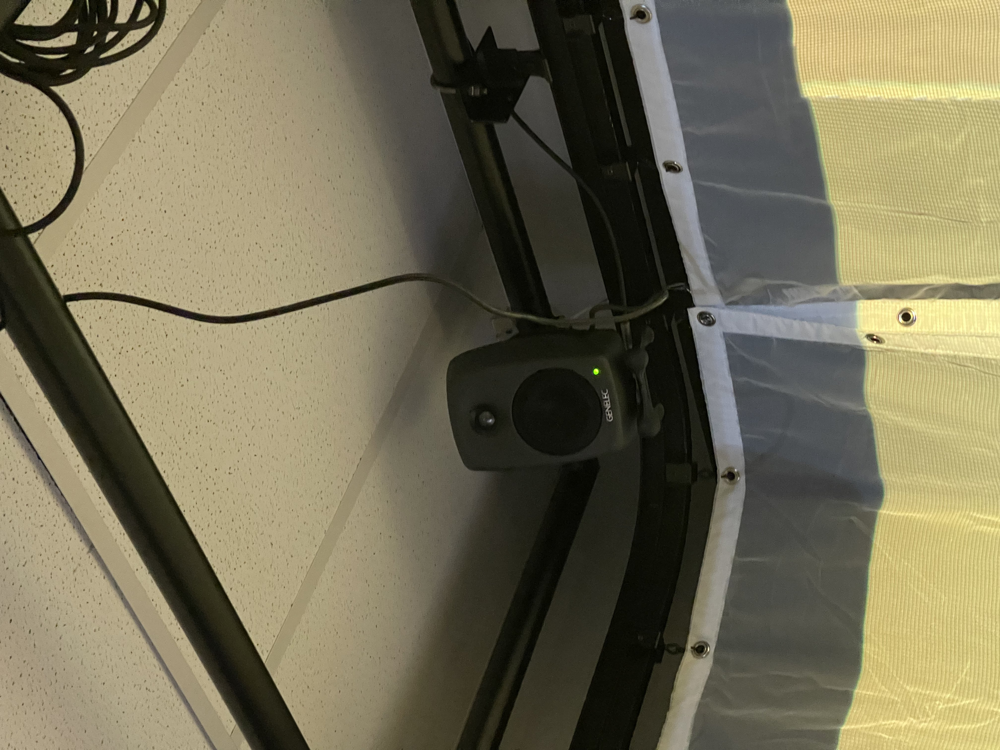
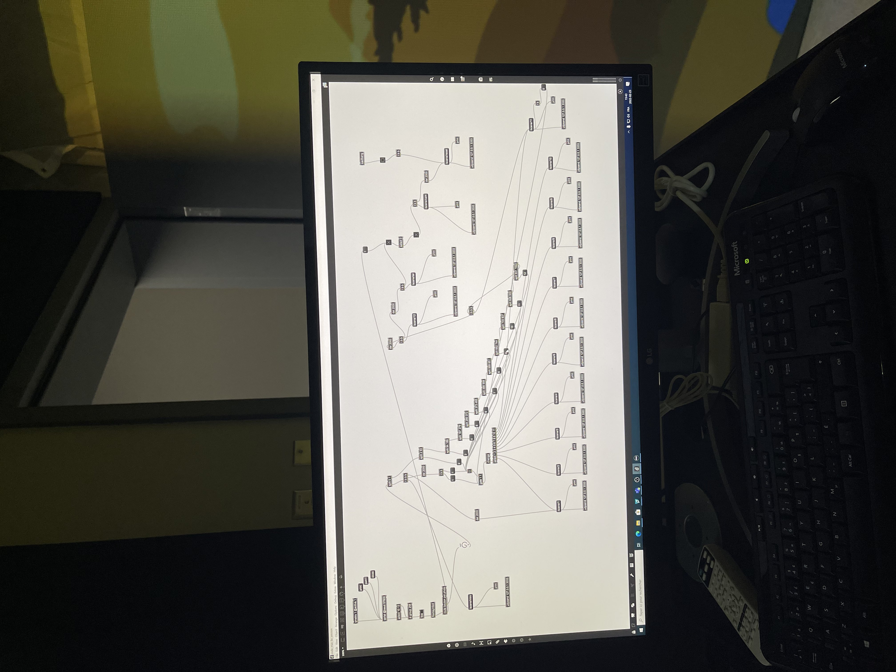
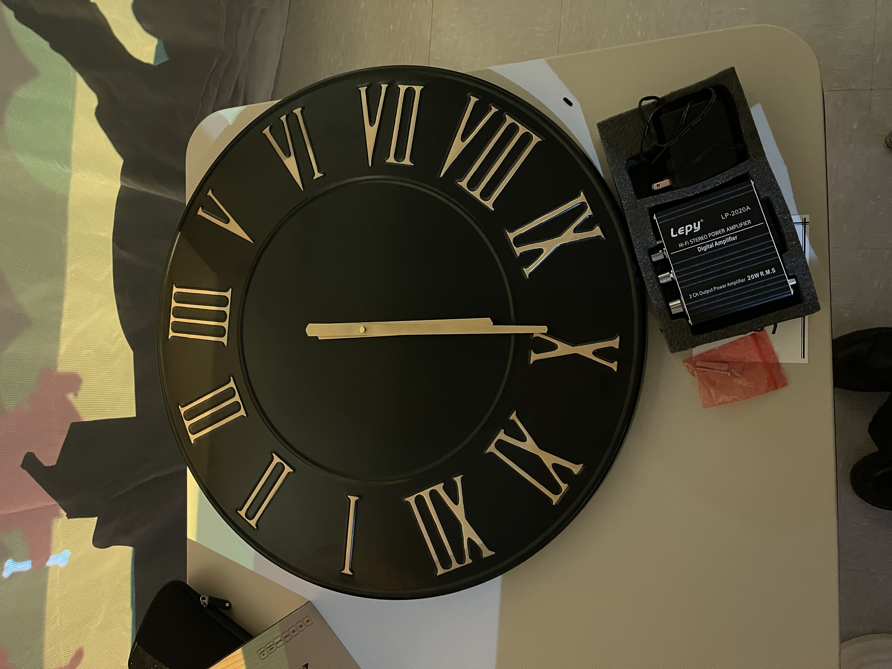
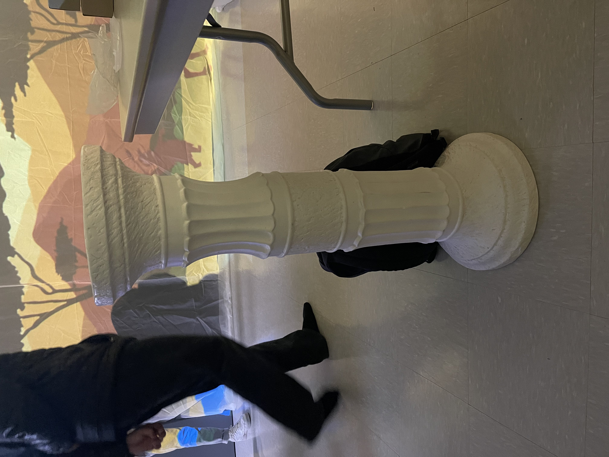
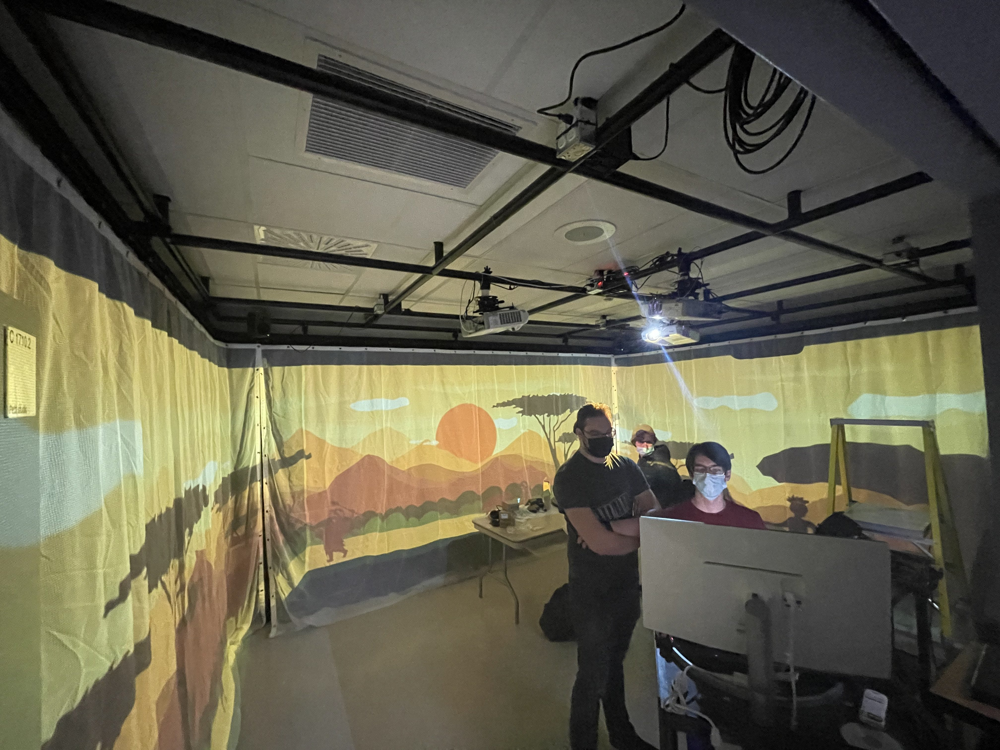
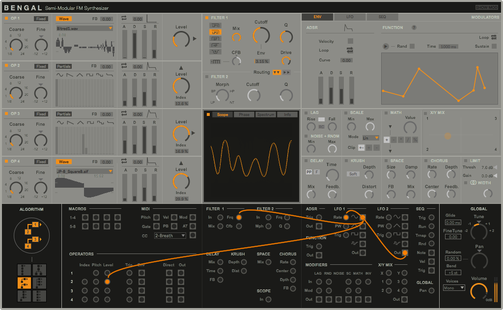

# L'horloge du l'apocalypse (2021 - 2022)

L'horloge de l'apocalypse est une installations créer et réaliser par les finissant de Troisième année du programme TIM (Techniques d'intégrations multimédias)
Les étudiantes/étudiants presenteront leurs installations le lundi 28 mars dans le petit Studio, dans le cégep Montmorency (Laval).

Les finissant/es ont eu pour thème de créer leurs installations au tours de la notion du temps.

Nous avons eu la chance de visiter les coulisses des installations le 23 février 2022.

L'oeuvre est décrite comme :

L’horloge de l’apocalypse représente la ligne du temps de l’humanité. Selon le concept de l’horloge, il est présentement 11 h 58 et il reste 2 minutes avant la fin de l’humanité. À travers ce projet, l’interacteur est invité à contrôler l’horloge grâce aux aiguilles et ainsi manipuler la ligne du temps. 

Au cours de l’expérience, vous pourrez vivre les différentes époques auxquelles la terre a été exposée. Vous serez exposé aux différents enjeux actuels à travers la projection qui vous entourera et par le fait même vous plongera dans une immersion totale.

[Site du projet](https://tim-montmorency.com/2022/projets/L-horloge-de-l-apocalypse/docs/web/index.html)

# Mise en espace de l'oeuvre 

L'oeuvre est installé dans le petit studio du Cégep,

Pour son fonctionnement elle utilise :

* 3 projecteurs 

* 4 hauts parleurs

* 1 ordinateur 

# Accesoires 

Niveau Accesoire, les artistes ont utilisées 

* une vielle horloge 

* un piedéstal 

* un ancien téléphone. 

Pour pouvoir projeter les illustrations, le groupe a suspendu des voiles blancs permettant une visualisation sur le mur.

# Logiciel utiliser 

* Illustration Numérique, Photoshop (logiciel de retouche,traitement d'image et dessin) 

* Conception Sonore, Max (logiciel de conception sonore) 

* Conception vidéo, OBS (logiciel de capture d'écran)

# Technique non connus 

* Max 8 

# Composante de la technique 

Max 8 est une platforme qui permet de créer ses propres instrument et effets sonores pour des performances live ou bien visuel.

# Expérience Vécue 

Les illustrations étaient bien excécutées et accompagner par des bandes sonores réaliser par le groupe eux mêmes.

Sur la partie interraction, nous n'avons pas pu tester car les étudiants étaient encore entrain de monter l'oeuvre.

# Membres de l'équipe 

* Maxime Sabourin 

* Louis Phillipe-Gravel 

* Alexis Lacasse  

* Tristan Girard-Montpetit 

* Maxime De Falco 
