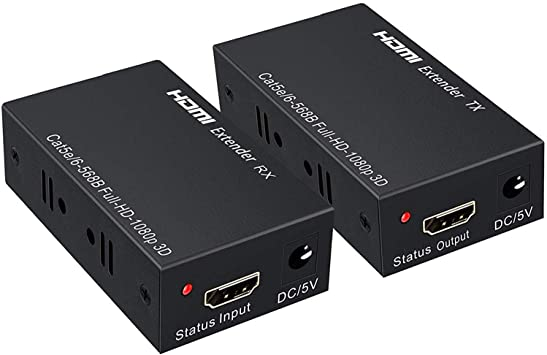

# Distorsion Collective (2021-2022)

Distorsion collective est une installations créer et réaliser par les finissant de Troisième année du programme TIM (Techniques d'intégrations multimédias)
Les étudiantes/étudiants presenteront leurs installations le lundi 28 mars dans le petit Studio, dans le cégep Montmorency (Laval).

Les finissant/es ont eu pour thème de créer leurs installations au tours de la notion du temps.

Nous avons eu la chance de visiter les coulisses des installations le 23 février 2022.

L'oeuvre est décrite comme :

L’expérience commence par la perspective d’un élève qui va commencer ses premiers cours en ligne durant le confinement avec enthousiasme. Les complications commencent à partir du moment où le professeur se présente, que les travaux s’accumulent, que la personne vit un sentiment d’isolement, et le tout dans une boucle sans fin qui s’accélère périodiquement et qui l’affecte mentalement. Une expérience sur des sensations réelles qui vous fera réfléchir.

[Site du projet](https://tim-montmorency.com/2022/projets/Distorsion-collective/docs/web/index.html)

# Mise en l'espace de l'oeuvre 

L'oeuvre est installée dans le grand studio parmi 4 autres installations.

Pour son fonctionnement elle utilise :

# *audio*:

* 2 Hauts-parleurs

* 2 fils XLR 3 conducteurs de 15' (M->F)

* 1 cable USB avec 2 sorties 

# *vidéo*:

* 1 projecteur vidéo grand angle 

* 1 système d'accrochage 

* 1 Kinect 

* 1 extender HDMI
* 

# *lumière*:

* 3 lumière LED RGBAW DMX

* 3 files XLR 3 conducteurs de 20'

# *éléctricité*: 

* 2 cordon IEC (pour l'alimentation des haut-parleurs)

# *réseau*: 

* 4 câbles Ethernet

# *ordinateur*: 

* 1 ordinateur portable performant 

# *autres: 

* Casque VR (réalité virtuelle)  Oculus 

La participante/participant va être invité à s'assoeir sur la chaise et mettre le Casque VR sur lui, iel aura en face de lui un ordinateur.

# Logiciel utiliser : 

* modelisation 3D (maya)

* Modélisation 3D (unity)

# Techniques non connus :
* Unity

# Composante de la technique :
* Unity est une platforme de développement fait pour les développeur/développeuse 2D/3D notamment fait pour les jeux-vidéos.

# Expérience Vécue: 

Je n'ai pas avoir accès à l'oeuvre car les étudiants n'étaient pas présent.

# Membres de l'équipe: 

* William Dubois

* Ghislain Lacombe 

 # Références :
 
L'ensemble des photos de références viennent d'internet.

